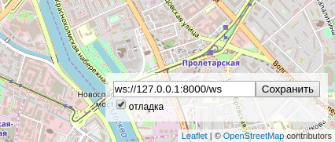

# Автобусы на карте Москвы

Веб-приложение показывает передвижение автобусов на карте Москвы.


## Как запустить

- Скачайте код
- Откройте в браузере файл index.html


## Настройки

Внизу справа на странице можно включить отладочный режим логгирования и указать нестандартный адрес веб-сокета.



Настройки сохраняются в Local Storage браузера и не пропадают после обновления страницы. Чтобы сбросить настройки удалите ключи из Local Storage с помощью Chrome Dev Tools —> Вкладка Application —> Local Storage.

Если что-то работает не так, как ожидалось, то начните с включения отладочного режима логгирования.

## Формат данных

Фронтенд ожидает получить от сервера JSON сообщение со списком автобусов:

```js
{
  "msgType": "Buses",
  "buses": [
    {"busId": "c790сс", "lat": 55.7500, "lng": 37.600, "route": "120"},
    {"busId": "a134aa", "lat": 55.7494, "lng": 37.621, "route": "670к"},
  ]
}
```

Те автобусы, что не попали в список `buses` последнего сообщения от сервера будут удалены с карты.

Фронтенд отслеживает перемещение пользователя по карте и отправляет на сервер новые координаты окна:

```js
{
  "msgType": "newBounds",
  "data": {
    "east_lng": 37.65563964843751,
    "north_lat": 55.77367652953477,
    "south_lat": 55.72628839374007,
    "west_lng": 37.54440307617188,
  },
}
```


## Используемые библиотеки

- [Leaflet](https://leafletjs.com/) — отрисовка карты
- [loglevel](https://www.npmjs.com/package/loglevel) для логгирования

--server
куда слать: ws://127.0.0.1:8080

--routes-number
сколько маршрутов взять из папки

--buses-per-route
сколько автобусов посадить на каждый

--websockets-number
сколько открыть реальных WS (обычно 5–10)

--emulator-id
удобно, если ты запускаешь 2–3 имитатора на одной машине

--refresh-timeout
частота движения

-v / -vv
логирование

ловим Ctrl+C и не сыпем огромным traceback

Запускаешь имитатор:
python fake_bus.py \
  --server ws://127.0.0.1:8080 \
  --routes-dir routes \
  --routes-number 200 \
  --buses-per-route 100 \
  --websockets-number 8 \
  --emulator-id test1 \
  --refresh-timeout 0.25 \
  --step-skip 2 \
  --shuffle \
  -v


Два имитатора параллельно:

python fake_bus.py --emulator-id A --routes-number 100 --buses-per-route 50 -v
python fake_bus.py --emulator-id B --routes-number 100 --buses-per-route 50 -v

Запускаешь сервер: python server.py -v
Список опций
bus_port - порт для имитатора автобусов
browser_port - порт для браузера
v — настройка логирования


Примеры запуска:

python server.py
python server.py --bus-port 9000 --browser-port 9001 -v
python server.py -vv

Запускаешь имитатор:
python fake_bus.py --server ws://127.0.0.1:8080 ...

Открываешь index.html, указываешь ws://127.0.0.1:8000/ws, галочку "отладка".

